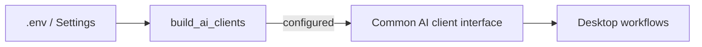

# Adding an AI Provider

AI providers implement the common interface in `src/ai/base.py` and are created centrally by `src/ai/factory.py`.

## Checklist

1. Add the provider module under `src/ai/providers/`.
2. Implement the `VocabularyAiClient` interface.
3. Keep provider response parsing compatible with the shared domain models and strict Grammar contract.
4. Add configuration fields to `src/core/config.py`.
5. Add user-editable keys to the safe setup/config handling in `src/core/user_setup.py`.
6. Add documented placeholders to `.env.example`.
7. Register the provider in `build_ai_clients()`.
8. Create the client only when its required configuration exists and the setup mode allows it.
9. Add provider-focused tests plus regression coverage for any bug discovered during integration.
10. Update this manual and `CHANGELOG.md`.

## Factory pattern

The GUI should not import or initialize a provider SDK just to populate a selector.

## Required interface

The current AI interface covers the major application workflows, including:

- vocabulary card generation,
- grammar card generation,
- provided-example/sentence card generation,
- conversation start,
- conversation feedback,
- grammar analysis.

Read `src/ai/base.py` before implementing a provider; do not infer the contract from one existing provider alone.

## Availability

A provider with no valid key/configuration should not be offered as if it were usable.

!!! example
    For a new cloud provider, an empty or placeholder API key should result in **no client being created**, not a broken selectable option in the normal GUI.
