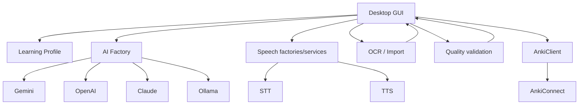

# Architecture

The application is a Python desktop project with provider integrations kept outside the GUI as far as possible.

## Current source layout

```text
src/
├── ai/             AI interface, prompts, factory, providers
├── anki/           AnkiConnect client, fields, templates
├── cli/            command-line interface
├── conversation/   conversation workflow and export
├── core/           configuration, setup, Learning Profile
├── domain/         models and language definitions
├── observability/  optional LLMOps/tracing
├── ocr/            import and extraction
├── practice/       practice workflow
├── quality/        local validation
├── speech/         STT, TTS, voice library, playback
└── ui/             classic and modern desktop GUI
```

## Main dependencies



## Protected invariants

These rules are architectural, not cosmetic.

### Human-in-the-loop

AI output remains a draft until the user reviews it. Import extraction, Queue generation, Fix Cards, and direct card generation must not silently bypass review.

### Learning Profile is the language source of truth

Learning language, level, and support/explanation language come from the persistent Learning Profile. Provider/API setup remains in `.env`.

### Providers are isolated from the GUI

The GUI consumes common interfaces and factory-built clients/services. Provider-specific SDK initialization should stay in provider modules and factories.

### Grammar contract is strict

Grammar generation uses a compact target-first contract and semantic self-checks. Invalid contract output is rejected instead of being silently adapted into a plausible-looking card.

### Duplicate protection is global and final

Prechecks exist for efficiency and UX, but duplicate protection must also run at the final Anki write boundary. Vocabulary identity follows the actual card target/front; Grammar identity follows the grammar target.

### Import routing remains reviewed

The protected flow is:

```text
Import Material → candidate review → Queue → generation/review → Anki
```

Only a semantic `usage_example` may be preserved as a Provided Example.

### Real bugs get regression tests

When fixing a production/reported bug, reproduce that exact failure in a test before treating the fix as complete.

!!! danger
    Avoid broad refactors in high-risk paths merely to make a local fix cleaner. Trace the active code path, identify the failed guard/contract, make the smallest reliable change, and run both new and related existing tests.
