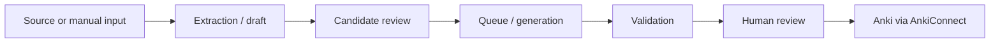

# AI Anki Language Assistant

**AI Anki Language Assistant** is a desktop application for creating reviewed language-learning Anki cards from vocabulary, grammar material, conversations, imported text/images/PDFs, and speech workflows.

The project is built around one principle: **AI proposes; the learner reviews; only approved content reaches Anki.**



## Start here

- New user: read [Getting Started](getting-started.md).
- Learn the workflows: open the [User Guide](user-guide/profile.md).
- Configure providers: see [Configuration](configuration/env.md).
- Working on the codebase: see the [Developer Guide](developer-guide/architecture.md).
- Something is not working: go to [Troubleshooting](troubleshooting/index.md).

!!! note "Current documented baseline"
    This first manual structure is aligned with the current `v12.4.8` codebase. Features that are planned but not implemented yet are explicitly marked as **planned**.

## Documentation development

Install the documentation dependencies once:

```powershell
pip install -r requirements-docs.txt
```

Run the documentation locally from the repository root:

```powershell
mkdocs serve
```

MkDocs will print the local preview address in the terminal. The documentation is not published by this setup.
