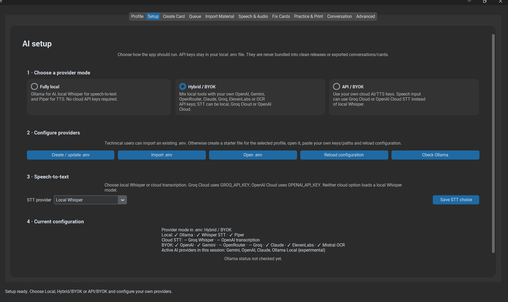

# Recommended setup

## Before configuring AI

First install:

- **Anki Desktop:** [https://apps.ankiweb.net/](https://apps.ankiweb.net/)
- **AnkiConnect:** [https://ankiweb.net/shared/info/2055492159](https://ankiweb.net/shared/info/2055492159)

In Anki:

**Tools → Add-ons → Get Add-ons... → code `2055492159`**

Restart Anki afterwards and keep it open when using AI Anki Language Assistant.

## What you need

1. **Anki Desktop**
2. **AnkiConnect**
3. **AI Anki Language Assistant**
4. **one API key: OpenAI or Gemini**

You do **not** need both keys.

## Option A — OpenAI

Create a key here:

[OpenAI API Keys](https://platform.openai.com/api-keys)

Then copy the key.

!!! note
    ChatGPT subscriptions and OpenAI API billing are separate. Having ChatGPT Plus/Pro does not automatically include API credit.

## Option B — Gemini

Create a key here:

[Google AI Studio API Keys](https://aistudio.google.com/apikey)

Sign in with your Google account, create an API key, and copy it.

## Paste the key into the app

Open:

**Setup → Recommended setup**

You will see two fields:

- **OpenAI API key**
- **Gemini API key**

Paste your key into the matching field and click:

**Apply recommended setup**

You do **not** need to open or edit `.env` manually. The application saves the key locally for you.

You can also configure both providers and choose between them in the application.

## Test Anki

Keep **Anki Desktop open**.

1. Open **Create Card**.
2. Enter a simple word or phrase.
3. Generate the card.
4. Review it.
5. Add it to Anki.
6. Confirm that the card appears in your Anki deck.

If that works, the basic installation is complete.
