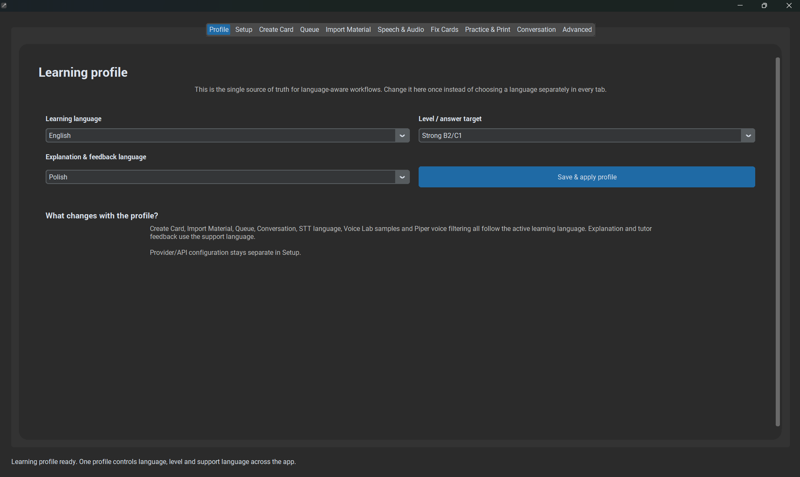

# Install the Windows EXE

## Quick links — click here

If you do not know where to start, use these links:

| You need | Click here | Do you need it? |
|---|---|---|
| **OpenAI API key** | [OpenAI API Keys](https://platform.openai.com/api-keys) | **Recommended** — easiest setup |
| **Gemini API key** | [Google AI Studio API Keys](https://aistudio.google.com/apikey) | Optional alternative to OpenAI |
| **Whisper** | [faster-whisper official GitHub](https://github.com/SYSTRAN/faster-whisper) | Optional local speech recognition; normally bundled in the EXE |
| **Piper** | [Piper official project](https://github.com/OHF-Voice/piper1-gpl) | Optional local audio; normally use Voice Library in the app |

**Recommended for most people:** use **OpenAI + Local Whisper + Piper**.

You do **not** need to install Whisper or Piper manually if the Windows release is packaged correctly. The links above are there for reference and troubleshooting.

This guide is for people who receive a ready-to-run Windows release and do **not** need Python, Git, a terminal, or programming knowledge.

## What you need

For normal flashcard creation, install or prepare only:

1. **AI Anki Language Assistant**
2. **Anki Desktop**
3. **AnkiConnect**
4. **one AI provider** — the recommended setup uses OpenAI

Speech recognition, local voices, OCR providers, and fully local AI are optional.

## 1. Install Anki Desktop

Download Anki from the official site:

[Download Anki Desktop](https://apps.ankiweb.net/)

Install it normally and open it once.

!!! important
    Keep **Anki Desktop open** while adding, updating, fixing, or scanning existing cards from AI Anki Language Assistant.

## 2. Install AnkiConnect

AI Anki Language Assistant communicates with Anki through the **AnkiConnect** add-on.

In Anki:

1. Open **Tools → Add-ons**.
2. Click **Get Add-ons...**
3. Enter the AnkiConnect code:

```text
2055492159
```

4. Confirm the installation.
5. Restart Anki.

Official add-on page:

[AnkiConnect on AnkiWeb](https://ankiweb.net/shared/info/2055492159)

## 3. Install AI Anki Language Assistant

Use the release supplied to you.

- If you receive a ZIP, extract it first.
- Keep the files together unless the release is explicitly marked as a single-file build.
- Start **AI Anki Language Assistant.exe**.

Windows SmartScreen can sometimes warn about newly distributed unsigned applications. If you trust the release source, open **More info** and continue.

You do **not** need to install Python for a packaged EXE release.

## 4. Create your Learning Profile

On the first launch, choose:

- **Learning language** — the language you are learning.
- **Level** — your approximate level.
- **Support language** — the language used for explanations and feedback.



These settings are reused throughout Create Card, Import Material, Queue, Conversation, STT, TTS, and feedback.

## 5. Use the recommended setup

For a first installation, continue with:

[Recommended setup](recommended-setup.md)

It uses:

- **Hybrid / BYOK**
- **OpenAI** for card generation and AI features
- **Local Whisper** for free local speech-to-text
- **Piper** for free local card audio

You only need one cloud API key.

## 6. First test

After configuration:

1. Keep Anki open.
2. Open **Create Card**.
3. Enter a simple vocabulary item such as `to put off`.
4. Generate the card.
5. Review it.
6. Add it to Anki.
7. Confirm that the note appears in Anki.

Then test optional features:

- **Conversation → Record** for speech-to-text.
- **Speech & Audio → Voice preview** for TTS.
- **Import Material** for lesson text, screenshots, or PDFs.

## Quick diagnosis

| Problem | What to check |
|---|---|
| Cannot connect to Anki | Anki is open and AnkiConnect is installed |
| No AI provider available | Add at least one API key in Setup |
| 401 / invalid API key | Recreate or re-enter the provider key |
| Microphone does not work | Windows microphone privacy permission |
| Whisper is slow the first time | The local model may still be downloading/loading |
| No voice/audio | Select a cloud TTS provider or download a Piper voice |

For more details see [Troubleshooting](../troubleshooting/index.md).
