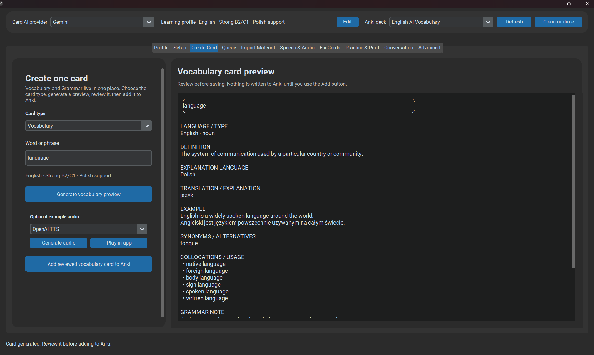

# Create Card

**Create Card** is the direct workflow for generating and reviewing one card at a time.



*Create and review Vocabulary or Grammar cards before they are written to Anki.*

## Vocabulary

Use Vocabulary for a word, expression, phrasal verb, collocation, or other lexical target. The provider generates structured learning content, local quality checks run, and the result remains editable before export.

## Grammar

Use Grammar for a concise grammar target such as `Third conditional` or `have as a dynamic verb`. Grammar generation follows a stricter contract described in [Grammar](grammar.md).

## Safe workflow

```text
Target → AI draft → validation → user review/edit → Anki
```

A failed validation should trigger review or regeneration, not a silent Anki write.
