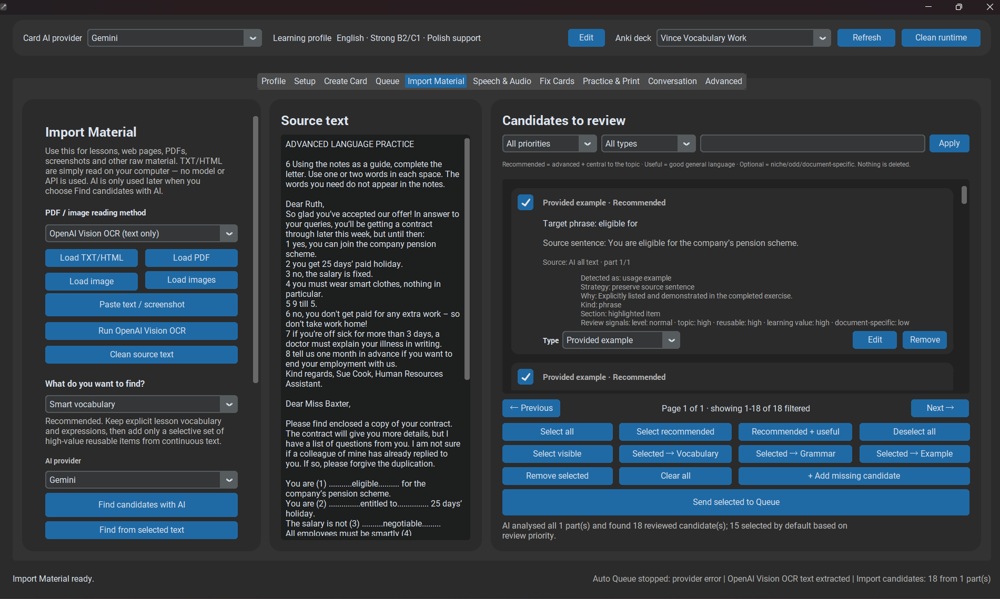

# Import Material

**Import Material** is the advanced workflow for lessons, TXT/HTML files, PDFs, screenshots, scans, and mixed learning material.



*Load source material, inspect extracted candidates, then send only approved items to Queue.*

Loading a source and extracting candidates are separate actions. The application should never silently treat a newly selected file as approved learning content.

## Main flow

```text
Load source
   ↓
Extract text / inspect source
   ↓
Find candidates
   ↓
Candidate review and cherry-pick
   ↓
Queue
   ↓
Generation + review
   ↓
Anki
```

## Source-role rule

Imported fragments are classified semantically. Only a real `usage_example` may be preserved as a **Provided Example**. Headings, labels, definitions, fragments, exercises, and other context must not be promoted simply because they contain the target text.

!!! important
    `Import Material → Queue → review → Anki` is a protected project workflow. Do not shortcut candidate review or final review when adding new import features.
