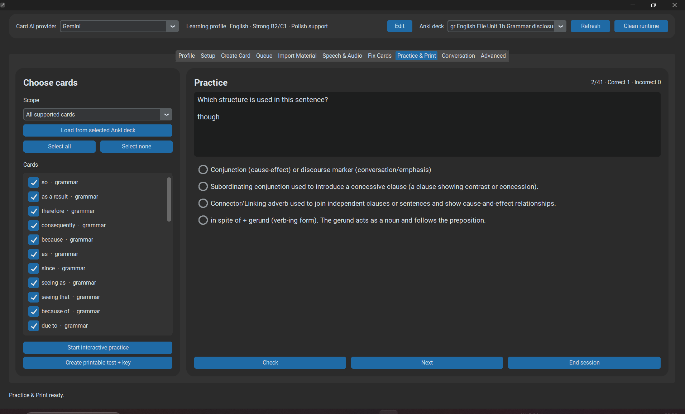

# Practice

**Practice** provides an application-side learning workflow in addition to normal Anki review.

*Practice turns reviewed material into an in-app learning session.*

Treat Practice as a consumer of reviewed learning material, not as a bypass around the generation/review pipeline.

Developer note: practice-specific code lives under `src/practice/`.
