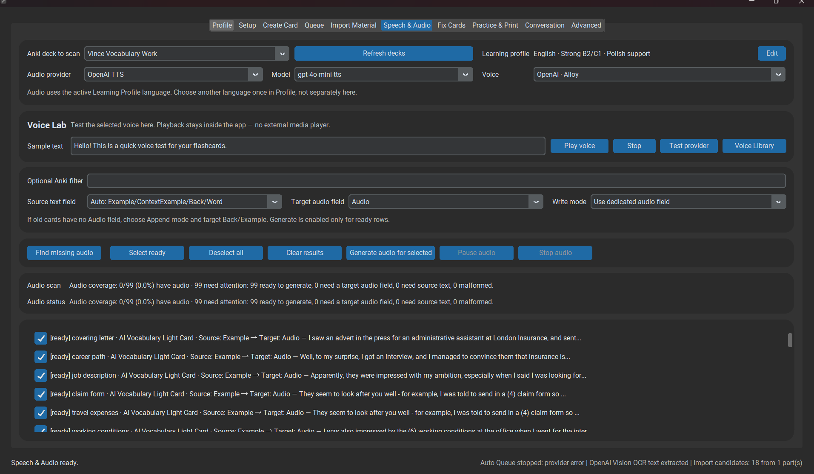

# Speech & Audio

Speech features are split into two independent layers:

*Speech & Audio combines STT selection, voice controls, and audio tooling.*

- **STT** — converts the learner's recording to editable text,
- **TTS** — generates audio for examples/cards and voice previews.

The active Learning Profile supplies the intended language where possible.

Current STT implementations are Local Whisper, OpenAI Cloud STT, and Groq Cloud STT. Current TTS implementations are Piper, OpenAI, Gemini, and ElevenLabs.

See [STT configuration](../configuration/stt.md) and [TTS configuration](../configuration/tts.md).
